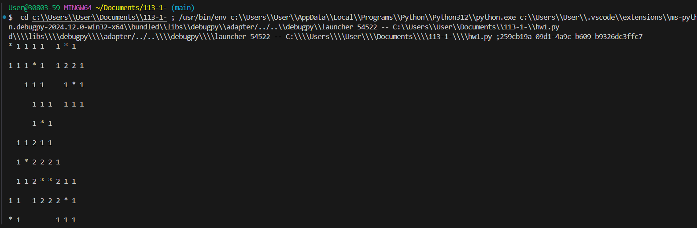

# 期中考
>
>學號：112111207
><br />
>姓名：陳品霖
><br />
>作業撰寫時間：60 (mins，包含程式撰寫時間)
><br />
>最後撰寫文件日期：2024/11/04
>
# 回答：


a. 小題

Ans：
```python
    # 步驟 a：建立一整數10x10 的 2D 陣列 `map`，並將所有元素初始化為 0
    map = [[0 for _ in range(10)] for _ in range(10)]
```

b. 小題

Ans：
```python
    ## 步驟 b：定義一個 1D 陣列 `rowMap`，其值為指定的炸彈位置索引
    rowMap = [0 for _ in range(10)]
```

c. 小題

Ans：

```py
    ## 步驟 b：定義一個 1D 陣列 `rowMap`，其值為指定的炸彈位置索引
    rowMap = [0, 7, 13, 28, 44, 62, 74, 75, 87, 90]

```


d. 小題

Ans：
```py
for index in rowMap:
    i = index // 10
    j = index % 10
    map[i][j] = '*'
```


e. 小題

Ans：
```py
步驟 e：定義函數以更新炸彈周圍格子的數字計數
def update_counts(map, row, col):
    for i in range(max(0, row-1), min(10, row+2)):
        for j in range(max(0, col-1), min(10, col+2)):
            if map[i][j] != '*':
                map[i][j] += 1

# 對每個炸彈位置進行周圍格子的計數更新
for index in rowMap:
    row = index // 10
    col = index % 10
    update_counts(map, row, col)

# 步驟 f：將所有為 0 的格子替換為空白字串，以符合格式
for i in range(10):
    for j in range(10):
        if map[i][j] == 0:
            map[i][j] = ' '

# 輸出最終的地圖
for rowMap in map:
    print(" ")
    print(' '.join(str(cell) for cell in rowMap))

```
輸出結果：



